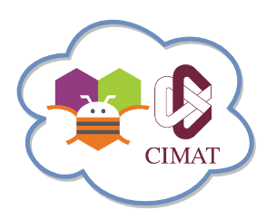

# My very first mobile app

 

An [App Inventor](https://appinventor.mit.edu/explore/index-2.html) workshop intended for mid school students, which will take place at [CIMAT](https://www.cimat.mx/) in Guanajuato, Mexico.

In this workshop we'll cover an step-by-step guide to build a basic mobile app and basic programing concepts so the students can get a complete development overview when making a mobile app (for technical side).

> App Inventor is a free, cloud-based service that allows you to make your own mobile apps using a blocks based programming language. You access App Inventor using a web browser (Chrome, Firefox, Safari)

## Requirements
* It's recomended to have small teams, two or three students at the most per team.
* Laptop with wifi access by each team.
* Celular or tablet with wifi access with MIT AI2 Companion by MIT Center mobile app installed to test the app in real time by each team too.
* Have an email account ready to be used, required only one by team.

## Get started
The workshop will be separated in five sections:
1. *Step-bystep guide to build our 'Hello world' mobile app and test it*, which will be explain App Inventor main components such as, views and types on blocks available.
2. *A friendly introduction to programming concepts* such as: data types, variables, loops and conditionals.
3. Step-by-step guide to build an extended colored digital doodle app based on this guide by [MIT App Inventor Tutorial #4](https://www.youtube.com/watch?v=fQKNzLYEN0M&feature=youtu.be)
4. *App challengues*: the students will be challenged to extend the previos app so the digital doodle
   * Change the background to a photograph or picture.
   * Let the user draw dots as well as lines (hint: Use DrawCircle block).
   * Add a button that turns on the camera and lets the user take a picture and then doodle on it.
 5. Final news about where to find more resources to build more complicated apps and the MIT App Inventor summit, so the students can search for more technical information and they can get exited to the idea about presenting their work in the related summit.
